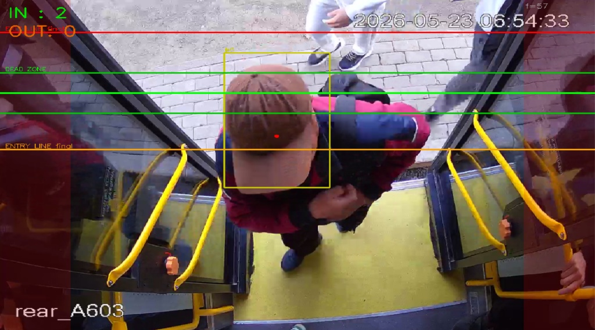
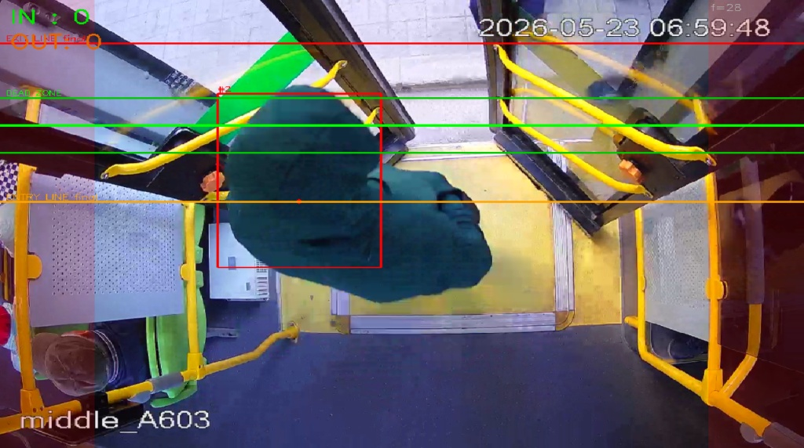
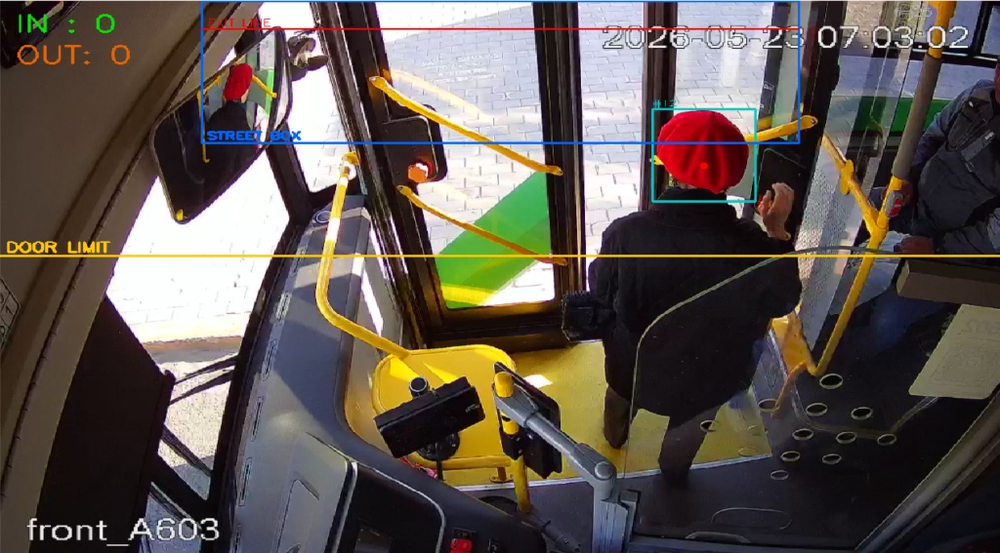

# Bus Passenger Counter

An automated bus passenger counting system utilizing computer vision and neural networks. 

The program analyzes a video stream in real-time, detects individuals, and tracks their movement through designated portals (doors), recording the number of passengers entering and exiting.

## Technologies
* **Python 3.12**
* **YOLOv8** (Ultralytics) - For object detection
* **OpenCV** - For video stream processing
* **PyTorch** - For GPU-accelerated model inference (CUDA)
* **Roboflow** - For dataset preparation and management

## About the Model
The project uses a custom model (`best.pt`) trained from scratch. 
* **Dataset:** 2298 images.
* **Training Epochs:** 100.
* **Tracking Logic:** The algorithm employs a portal-based system. To improve line-crossing detection accuracy, a coordinate multiplier of 0.38 is applied when calculating the object's centroid.

## Installation and Setup

1. **Clone the repository:**
   ```bash
   git clone [https://github.com/YOUR_USERNAME/bus_passenger_counter.git](https://github.com/YOUR_USERNAME/bus_passenger_counter.git)
   cd bus_passenger_counter
Create and activate a virtual environment:

PowerShell
python -m venv .venv
.\.venv\Scripts\Activate.ps1
Install dependencies:
This project requires PyTorch with CUDA support for optimal GPU performance.

PowerShell
pip install -r requirements.txt
Run the application:
Use the main script to start processing:

PowerShell
python bus_counter_oneline.py --all


Project Structure
bus_counter_oneline.py - Main counting script.

front_cam_counter.py - Tracking logic for the front camera.

extract_frames.py / sort_videos.py - Utilities for dataset processing.

requirements.txt - List of project dependencies.

Project Status
The project is currently in active development. The tracking and portal-crossing logic is continuously being calibrated to achieve maximum counting accuracy in dense passenger flow conditions.


## Visuals

The system successfully processes video streams from various angles, tracking passenger movement through designated zones and lines.

**Rear Camera Detection:**


**Middle Camera Detection:**


**Front Camera Detection:**
